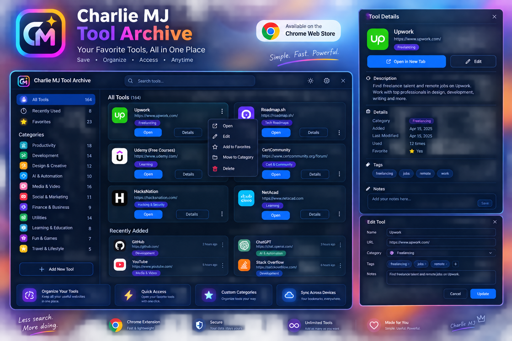

# ✨ Charlie MJ Tool Archive

A modern **Manifest V3 Chrome extension** for organizing a large personal collection of websites, tools, learning resources, AI services, developer utilities and bookmarks.

<p align="center">
  
</p>

## 🚀 v4.0.0 — Smart Library

The extension is local-first, but its default library can also stay synchronized with the public GitHub repository.

### Core features

- 🔎 Fast search across names, URLs, categories, descriptions, notes and tags
- 🧠 Advanced search filters such as `category:Instagram`, `tag:download`, `favorite:true`, `type:Website`, `used:recent`
- 🗂️ Smart category autocomplete with tool counts
- 🏷️ Smart tag suggestions
- ⚠️ Duplicate URL detection while adding or editing
- 🔎 Similar-tool warnings before adding a new website
- 🧹 Duplicate cleanup and Library Health diagnostics
- 🗃️ Category Manager with rename, merge and delete/reassign
- ☑️ Bulk selection and actions
- ⭐ Favorites and Recently Used
- 📊 Usage count and last-used tracking
- ↗️ Open visible tools or selected tools
- ✎ Full details and edit/update view
- 🖱️ Chrome context-menu save action

### ☁️ GitHub → Extension automatic sync

The extension reads:

`data/default-tools.json`

from:

`https://github.com/awsrmmustansarjavaid/charlie-mj-tool-archive`

It synchronizes automatically and also provides **Sync from GitHub Now** in Settings.

Sync is intentionally non-destructive:

- New GitHub tools are added automatically.
- Existing local favorites are preserved.
- Personal notes are preserved.
- Usage history is preserved.
- Local descriptions/categories are not blindly overwritten.
- Missing local descriptions/tags can be enriched from GitHub data.
- Duplicate URLs are merged instead of being added twice.

The background service worker also schedules periodic synchronization while Chrome is active.

### 💾 Backup & export

- JSON backup
- JSON restore
- CSV export
- Self-contained detailed HTML export
- Restore bundled defaults
- Import JSON with preview
- Import Chrome bookmark HTML with preview

### 🩺 Library Health

The Health panel checks for:

- duplicate URL groups
- missing descriptions
- missing categories
- invalid URLs
- never-used tools
- total tools and categories

### 🌐 Website Health Checker

A manual link checker can test saved websites and display working, warning or failed/blocked results. Some websites intentionally block automated requests, so a warning does not necessarily mean that the website is unavailable in a normal browser.

## 📁 Project structure

```text
charlie-mj-tool-archive/
├── data/
│   └── default-tools.json
├── docs/
│   └── DATA-FORMAT.md
├── icons/
│   ├── icon16.png
│   ├── icon32.png
│   ├── icon48.png
│   ├── icon128.png
│   └── logo.svg
├── src/
│   ├── background.js
│   ├── dashboard.html
│   ├── dashboard.js
│   └── styles.css
├── manifest.json
├── LICENSE
└── README.md
```

## 🧩 Data architecture

`default-tools.json` is the **bundled/GitHub seed snapshot**. The live library is stored in Chrome's local extension storage.

```text
GitHub default-tools.json
          ↓
Bundled default-tools.json
          ↓
Chrome local storage
          ↓
LIVE TOOL LIBRARY
```

This prevents a packaged extension from treating its own read-only source files as a writable database.

## 🔄 Recommended workflow

1. Add or edit tools in the extension.
2. Use JSON/HTML backup when needed.
3. Update `data/default-tools.json` in GitHub when you want to publish new default tools.
4. Open the extension again or use **Settings → Sync from GitHub Now**.
5. New GitHub records are merged into the local library automatically.

## 🛠️ Install locally

1. Download or clone this repository.
2. Open Chrome and go to `chrome://extensions/`.
3. Enable **Developer mode**.
4. Choose **Load unpacked**.
5. Select the project folder containing `manifest.json`.
6. Open **Charlie MJ Tool Archive**.

After source changes, use **Reload** on the extension card.

## 🔐 Permissions

The extension uses:

- `storage` — local library/settings data
- `bookmarks` — Chrome bookmark integration
- `tabs` — opening saved tools
- `contextMenus` — right-click save action
- `alarms` — periodic GitHub synchronization
- GitHub and web host permissions — GitHub library synchronization and the manual website-health checker

The extension does not need a GitHub login for this public repository because it only reads the public `default-tools.json` file.

## 📦 Version

**4.0.0 — Smart Library + GitHub Sync**
